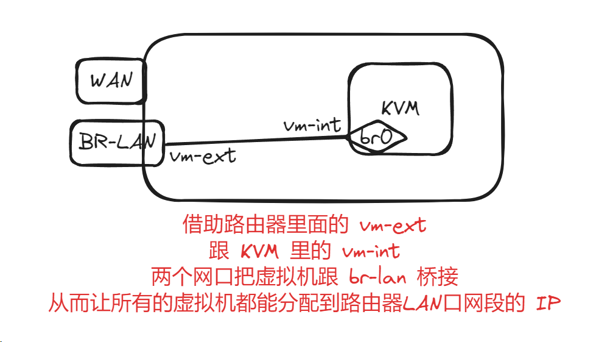

### 在 iStoreOS 安装虚拟机平台

1. 从 SSH 进到 Docker 命令行：docker exec -it webvirtcloud bash
2. 用命令在 iStoreOS 里面从 img 转换到  qcow2 参考：
```
opkg update
opkg install qemu-img
qemu-img convert -f raw -O qcow2 ./haos_generic-x86-64-11.2.img ./haos.qcow2
```
3. 上传镜像到系统，并加载镜像。文件夹的位置在插件选择的目录里面的 images 里面，上传好比如 iso 就可以让虚拟机识别了
4. 网络桥接原理如图所示：（会自动桥接到 br-lan 口，如果 br-lan 口没接网线，只接了 WAN 口，则建议用 NAT 网络



### 安装 HomeAssistant 虚拟机参考

这个是 HomeAssistant 的安装视频，可以作为大家手动安装虚拟机的参考：

<iframe src="//player.bilibili.com/player.html?aid=236949444&bvid=BV1Qe411o7Qt&cid=1358788868&p=1" scrolling="no" border="0" frameborder="no" framespacing="0" allowfullscreen="true"> </iframe>

### 更新插件参考

建议是，停止了，插件，再更新插件，再启动插件。  
这样保证在运行中从被停止了，才会更新成功。参考视频：  

<iframe src="//player.bilibili.com/player.html?aid=494608438&bvid=BV1NN411L7BU&cid=1363300025&p=1" scrolling="no" border="0" frameborder="no" framespacing="0" allowfullscreen="true"> </iframe>


### 其他参考链接：

* [PVE 安装Windows 虚拟机并显卡直通](https://3os.org/infrastructure/proxmox/windows-vm-configuration/)