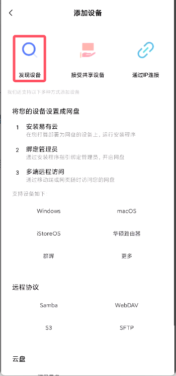

## 网页端绑定教程

易有云安装后第一次打开，需要绑定设备。  
绑定成功后，每次登录时，需使用绑定的账号登录。  
否则，向导页面将无法登录。  

### 易有云登录方式
#### 登录前先[注册易有云](https://doc.linkease.com/zh/guide/linkease/account/register.html)
 ①方式一：打开手机易有云APP，扫描登录二维码登录； 
 ②方式二：短信验证码进行登录； 
 ②方式三：输入您所注册的易有云账号密码进行登录；

### 登录后，进入网盘初始设置页面，设置网盘名称及私有网盘位置
- 私有网盘名称：你这台设备的名称；
- 私有网盘位置：你这台设备允许易有云访问的目录路径；
- 主目录：用来存储一些配置文件

### 成功开启网盘后，即可使用易有云，你也可以直接点击下面几个功能使用易有云。

## APP端绑定教程

管理员如何绑定设备？

**1.安装易有云App，注册登录并打开，【添加设备】——【发现设备】，会自动扫描局域网内可绑定设备，点击进行绑定；**

* 绑定设备前提：开启手机WiFi，并确保您的手机与要绑定的设备在同一内网网络下。
* 若是iStoreOS可直接通过IP地址绑定。

**2.发现设备后，点击进入设备初始设置页面；**

**3.进行设备初始设置，设置别名和易有云要绑定的路径(安装目录)，然后确定就绑定成功了。**

**4.首位用户绑定设备后成为该设备的管理员，一个设备只能有一个管理员。**